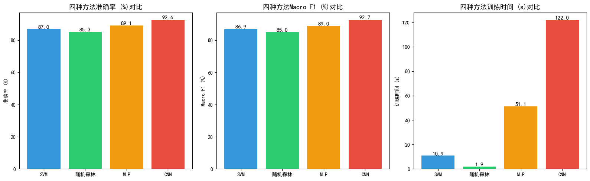

# Fashion MNIST 服饰分类——机器学习算法对比研究

基于 [Fashion MNIST](https://github.com/zalandoresearch/fashion-mnist) 数据集（10 类服饰，70,000 张 28×28 灰度图），横向对比 **SVM、随机森林、MLP、CNN** 四种方法的分类性能。

## 结果总览

| 方法 | 准确率 | Macro F1 | 训练时间 | 设备 |
|------|--------|----------|----------|------|
| **CNN** | **92.79%** | 92.77% | 128.2s | GPU (4070 Ti) |
| MLP | 88.98% | 88.99% | 41.5s | GPU (4070 Ti) |
| SVM | 87.01% | 86.93% | 10.95s | CPU |
| 随机森林 | 85.26% | 85.04% | 1.91s | CPU |



## 项目结构

```
.
├── Fashion_MNIST_Classification.ipynb   # 完整代码（数据探索 → 训练 → 对比 → 可视化）
├── fig_comparison.png                   # 四种方法准确率/F1/训练时间对比图
├── .gitignore
└── README.md
```

## 快速开始

```bash
git clone https://github.com/wakawakajie/Fashion-MNIST-Classification.git
cd Fashion-MNIST-Classification
pip install -r requirements.txt
jupyter notebook Fashion_MNIST_Classification.ipynb
```

## 分工说明

| 部分 | 内容 | 负责 |
|------|------|------|
| Part 1 — 传统机器学习 | 数据预处理、SVM、随机森林 | 组员A |
| Part 2 — 深度学习 | MLP、CNN 模型设计与训练 | 组员B |
| 共同完成 | 方法对比分析、可视化、报告撰写 | — |

## 实验环境

| 环境 | 配置 |
|------|------|
| **Part 1**（组员A） | Intel Core i7-13700 / Python 3.12 + scikit-learn 1.9 |
| **Part 2**（组员B） | Intel Core i5-12600KF / NVIDIA GeForce RTX 4070 Ti / TensorFlow 2.21 / CUDA 12 |
| **共同** | Windows 11 / Jupyter Notebook |

## 方法简介

- **SVM**：RBF 核，C=10，10k 样本训练
- **随机森林**：200 棵树，max_depth=20
- **MLP**：3 层全连接（512→256→128），BatchNorm + Dropout
- **CNN**：3 个卷积块 + 全局平均池化 + 数据增强（旋转/缩放/平移）

## License

MIT
